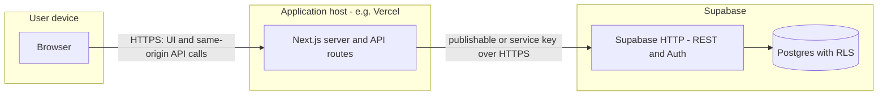

# App structure, Supabase connection, and database construction

This page is aimed at **IT and technical stakeholders** who asked for:

- The **structure of the application** (where code lives and what it does).
- **How the app connects to Supabase** (which keys, which code paths, and what runs where).
- **How the Supabase (Postgres) database is constructed and evolved** (migrations, not free‑hand changes in production only).

For a **concrete, local** workflow (Docker, `pnpm dev`, `supabase db reset`, `/docs`), use [Local development](./local-development.md) first, then return here for deeper detail. The [System Overview](./architecture.md) page is the high-level **production** topology. [Users, GitHub, Supabase, and Vercel](./admin-platforms.md) covers **hosted** operations and the **GitHub → deploy** path.

---

## 1. Application structure (repository)

The **root** of the monorepo holds the main web app, database definitions, and supporting packages.

| Path | Purpose |
|------|--------|
| `app/` | **Next.js App Router**: pages and layouts under `app/*`; **API routes** under `app/api/*` (HTTP handlers for batches, customers, log files, auth, etc.). |
| `lib/` | **Shared server/browser utilities**: Supabase client factories (`lib/supabase/*`), session handling, log parsing, sequence/CSV logic, email helpers. |
| `components/` | **Reusable UI** (buttons, forms, theme) used by routes. |
| `supabase/` | **Database** — `migrations/` (versioned SQL), `seed.sql` (local data), `config.toml` (local Supabase stack). This is the **authoritative** definition of schema for environments that apply migrations. |
| `docs-site/` | **Docusaurus** source; build output is copied to **`public/docs`** and served at **`/docs`** on the main app. |
| `windows-upload-service/` | **Node service** (runs on customer Windows Server) that uploads log files to the app’s **ingest API** — it does **not** talk to Supabase directly. |
| `scripts/` | **Maintenance/utility** scripts (e.g. `create-user.ts` for creating Auth users from `public.users`). |

**Runtime model:** a single **Next.js** process serves HTML/API on Node.js. There is no separate “Java app server” — business logic is in the Next app (mostly `app/` and `lib/`). Long‑running background workers are not part of the default stack; the Windows uploader is a **separate** process on your network.

---

## 2. How the app connects to Supabase

Supabase provides **Postgres** (data), **Row Level Security (RLS)**, and **Auth** (user identities). The WasteZero app does **not** open a raw TCP connection to Postgres from the browser. It uses the **Supabase client libraries**, which call Supabase’s **HTTP APIs** (REST, Auth) using your project **URL** and **API keys**.

### Environment variables (typical)

| Variable | Used for |
|----------|-----------|
| `SUPABASE_URL` | Project base URL (same for all clients). |
| `SUPABASE_PUBLISHABLE_KEY` | **Anon (publishable) key** — safe to scope to a logged‑in user session; RLS and policies still apply. |
| `SUPABASE_SECRET_KEY` | **Service role** key — **server only**; bypasses RLS. Used for privileged operations the browser must never perform directly. Never expose in client-side bundles. |

(Exact names in your deployment should match the app’s `lib/` — service role is read in `lib/supabase/admin.ts`.)

### Three ways the code talks to Supabase

1. **Browser** (`lib/supabase/client.ts`)  
   - Uses the **publishable** key.  
   - For React client components that need a Supabase client in the browser.

2. **Server (SSR, cookies)** (`lib/supabase/server.ts`)  
   - Uses the **publishable** key and **request cookies** (via `@supabase/ssr`) so the **Auth session** is available on the server.  
   - For Server Components, route handlers, and “who is logged in?” in middleware‑adjacent code.

3. **Admin (service role)** (`lib/supabase/admin.ts`)  
   - Uses **`SUPABASE_SECRET_KEY`**.  
   - **Only import this from server code** (e.g. API routes, `lib` modules that never run in the browser).  
   - Used when the app must read/write tables that are locked down to the service role under RLS, or to call Supabase **Admin** APIs (e.g. user provisioning scripts).

**Important:** many tables in this project are configured with RLS so **anon/authenticated** roles have **no** direct access; the app is expected to use **server-side** code with the **service role** for those tables, or expose **curated** access through API routes. That pattern is why **API routes** in `app/api/` are central.



The **Windows log upload service** only calls your **Next.js** HTTPS endpoint (`/api/log-files/ingest`); it does **not** use Supabase keys.

---

## 3. How the Supabase database is constructed

The database is **not** “designed only in the Supabase UI” in production. **Authoritative** schema changes are **version-controlled SQL** under:

```text
supabase/migrations/
```

### Migration workflow (conceptual)

1. **New change** (table, column, function, RLS, index) is added as a **new file** in `supabase/migrations/`, with a **timestamp prefix** in the filename so order is explicit (e.g. `20250222100010_create_log_files.sql`).
2. **Local development:** `supabase db reset` (or start fresh) applies **all** migrations in order, then can run `supabase/seed.sql` for sample rows.
3. **Hosted (staging/production):** the same files are applied with the Supabase CLI, typically `supabase db push` (after `supabase link` to the project) or your **CI** workflow. The repository’s `supabase/README.md` file describes `link`, `push`, and local vs remote in detail.

**Rules of thumb for IT and DBAs**

- The **migrations folder** is the **contract** for what the running database should look like.  
- **Do not** rely on one-off changes in the SQL Editor in production as the only record — capture permanent changes in a new migration.  
- **`supabase/seed.sql`** is intended for **local** resets; it is **not** a substitute for migrations. Whether seed runs in CI depends on your workflow; production data usually comes from real use, not the seed file.

### What the migrations build (summary)

Migrations add and evolve, among other things:

- **App users (allow list):** `public.users` (emails allowed to use the app), related OTP/login tables, RLS.  
- **Core business:** `customer`, `customer_sequence`, `batch`, `batch_downloads`, triggers (e.g. `modified` timestamps).  
- **Printer / camera logs:** `log_files`, `log_entries`, duplicate handling, materialized or derived fields (e.g. duplicate counts), support tables for performance.  
- **Reporting:** report tables/views (e.g. customer bags) and `vw_api_*` views that back read APIs.  
- **API abstraction:** some **SQL views** (`vw_api_*`) isolate API consumers from raw table renames.  

Exact names and behavior change over time — always use **current** migrations in Git as the source of truth, not a static list in documentation.

### Functions and triggers

Many behaviors (e.g. duplicate flagging, report refresh, ingest finalization) are implemented as **PostgreSQL functions** and **triggers** inside migrations. The app calls some of them via `rpc()` from the server. That is still “Supabase” in the sense of your hosted Postgres + PostgREST / client RPC.

---

## 4. Does the existing doc set cover the IT request?

| Request | Where it is covered now |
|--------|-------------------------|
| **Structure of the app** | This page (§1) + [System Overview](./architecture.md) (diagram, hosting). |
| **How the app connects to Supabase** | This page (§2), including keys and the three client patterns. |
| **How the DB is constructed** | This page (§3) + [System Overview](./architecture.md) and [admin-platforms](./admin-platforms.md) (push/CI) + `supabase/README.md` in the repository for CLI commands. |

**Recommendation:** for someone **setting up a dev machine**, start with [Local development](./local-development.md). For the **three bullets** above in depth, use **this page**, then [System Overview](./architecture.md) for the big picture, and [admin-platforms](./admin-platforms.md) for production GitHub/Vercel/Supabase dashboards and user onboarding.

For end-user **using** the app (clicks, menus), the [Quick start](./help.md) page remains the right place.
