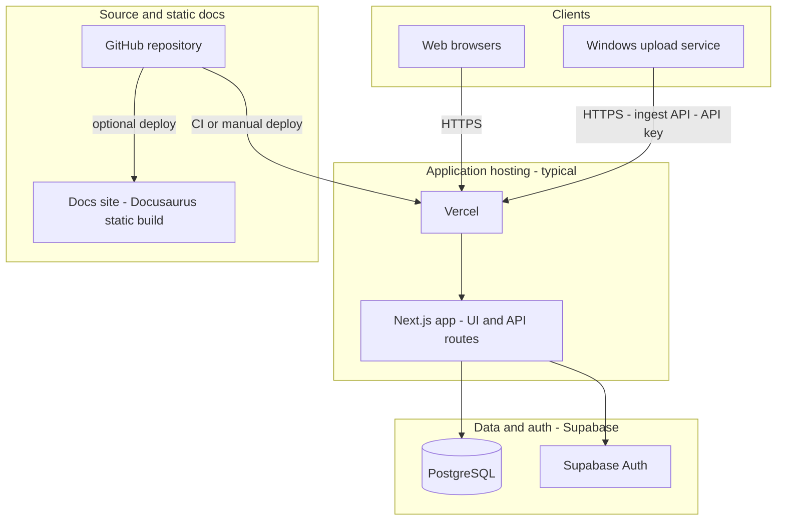

# Architecture & operations

This page is for **IT and administrators**: how the WasteZero system is structured, where components run, and how to run, deploy, and operate it with **GitHub**, **Supabase**, and **Vercel**.

- For **repository layout**, **how the Next.js app connects to Supabase (keys and clients)**, and **how the database is built from migrations**, start with [App structure, Supabase connection, and database construction](./app-structure-and-database.md).
- For **adding users**, **GitHub/Supabase/Vercel navigation**, **CI database deploys**, and **migrations vs ad-hoc SQL**, see [Users, GitHub, Supabase, and Vercel](./admin-platforms.md).

## System diagram

The application is a **Next.js** web app that talks to **Supabase** (PostgreSQL + Auth). Optional components: a **Docusaurus** documentation site in this repo, and a **Windows file upload service** on your network that posts log files to the app’s HTTP API.

| Component | Role | Typical hosting |
|-----------|------|------------------|
| **Next.js app** | Web UI, protected pages, REST API (batches, customers, logs, OTP auth) | **Vercel** (or any Node host: Docker, VM, etc.) |
| **Supabase** | Database (schema in `supabase/migrations/`), row-level security, **Auth** for users | **Supabase Cloud** project, or local Docker via Supabase CLI for development |
| **Windows upload service** | Watches folders, uploads `*.txt` / `*.csv` to `/api/log-files/ingest` | **On-premises Windows Server** (not hosted by Vercel) |
| **Docs site** | Static help (this `docs-site` package) | **Vercel**, Netlify, GitHub Pages, or any static host |
| **GitHub** | Source code, branches, pull requests, optional Actions | **github.com** (or GitHub Enterprise) |

**Data flow (simplified):**

- Browsers use the app over HTTPS; sessions use cookies (`SESSION_SECRET` on the server).
- The app’s server code uses the Supabase **service role** key only on the server to manage data and admin Auth operations; the browser uses the **anon/publishable** key for user-scoped Supabase access.
- The Windows service never connects to Supabase directly; it only calls your **deployed** Next.js URL with a shared **ingest API key** (`LOG_FILES_INGEST_API_KEY` on the server, `apiKey` in the service `config.json`).

---

## How the app runs

- **Runtime:** [Next.js](https://nextjs.org) (App Router) on **Node.js**.
- **Frontend:** React, server and client components; Tailwind + Radix-style UI.
- **Backend:** Next.js **Route Handlers** under `app/api/`; server-only code in `lib/` (Supabase clients, session, email, log parsing).
- **Database:** PostgreSQL via [Supabase](https://supabase.com). Schema is defined in `supabase/migrations/`. The app does not require Supabase “Edge Functions” for core features; business logic is in the Next.js server.

---

## Run locally (developers / staging)

1. **Install:** Node 18+, [pnpm](https://pnpm.io), and (for local DB) [Docker](https://docker.com) + [Supabase CLI](https://supabase.com/docs/guides/cli).
2. **Clone** the repo from GitHub and `pnpm install` at the repo root.
3. **Environment:** copy `.env.example` to `.env.local` and set at least:
   - `SUPABASE_URL`
   - `SUPABASE_PUBLISHABLE_KEY` (anon / browser-safe)
   - `SUPABASE_SECRET_KEY` (service role — server only; never expose to the client)
   - `SESSION_SECRET`
4. **Local database (optional but typical):** `pnpm exec supabase start`, then `pnpm exec supabase status -o env` and merge keys into `.env.local`. Apply schema with `pnpm exec supabase db reset` (runs migrations + seed). For hosted databases, use the Supabase CLI (`supabase link`, `supabase db push`); details are in `supabase/README.md` in the repository.
5. **Start app:** `pnpm dev` → [http://localhost:3000](http://localhost:3000).  
   Convenience: `pnpm run dev:full` stops/starts local Supabase then the dev server.

**Docs site locally:** from repo root, `pnpm docs:start` (Docusaurus dev server; default port is often 3000 — stop the Next app or set a different port if both run at once).

---

## Administration: GitHub

| Task | Where / how |
|------|-------------|
| **Source of truth** | `main` (or your default branch) and feature branches. |
| **Change control** | Pull requests, code review, branch protection (recommended: require review, CI passing). |
| **Secrets** | **Do not** commit `.env` or API keys. Store production secrets in **Vercel** and **Supabase** dashboards, or your org’s secret manager. |
| **Migrations** | New SQL in `supabase/migrations/` via PR; apply to hosted DB with Supabase CLI after merge (`supabase link`, `supabase db push`) or your approved release process. |
| **Optional CI** | You can add GitHub Actions to run `pnpm lint`, `pnpm build`, or Supabase checks on each PR. |

---

## Administration: Supabase

| Task | Where / how |
|------|-------------|
| **Dashboard** | [app.supabase.com](https://app.supabase.com) → your project: **Table Editor**, **SQL**, **Auth** users, **Database** → backups, **Settings** → API URL and keys. |
| **Apply schema** | Migrations in the repo are the **source of truth**. For hosted DB: [Supabase CLI](https://supabase.com/docs/guides/cli) `supabase link` then `supabase db push` (see `supabase/README.md` in the repo). |
| **Auth** | Users for OTP login; allowed users may also be seeded in `supabase/seed.sql` for local dev. |
| **Backups & compliance** | Use Supabase project backup/restore and org policies. |
| **Service role key** | Treat like a root password: only in server env (e.g. Vercel env as `SUPABASE_SECRET_KEY` or align with your `.env` naming). Never in browser or client bundles. |

---

## Administration: Vercel

| Task | Where / how |
|------|-------------|
| **Import project** | [vercel.com](https://vercel.com) → New project → import the **GitHub** repo. |
| **Environment variables** | Project → **Settings** → **Environment** — set the same names as `.env.local` (e.g. `SUPABASE_URL`, `SUPABASE_PUBLISHABLE_KEY`, `SUPABASE_SECRET_KEY`, `SESSION_SECRET`, optional `LOG_FILES_INGEST_API_KEY` for the Windows uploader, SMTP for OTP). |
| **Supabase on Vercel** | You can use the [Vercel Supabase integration](https://vercel.com/integrations/supabase) to sync some variables; still confirm service role and app-specific keys manually. |
| **Domains** | **Settings** → **Domains** — attach production and preview URLs. |
| **Preview deployments** | Each PR can get a preview URL; use **Preview** env vars if keys differ. |
| **Deployment Protection** | If you enable Vercel Authentication / password on previews, the **Windows upload service** must send the [Protection Bypass for Automation](https://vercel.com/docs/security/deployment-protection/methods-to-bypass-deployment-protection/protection-bypass-automation) header (`x-vercel-protection-bypass`); see `windows-upload-service/README.md` in the repo. The ingest **API key** is separate and still required. |
| **Docs static site** | Build `docs-site` with `pnpm docs:build`, deploy the `docs-site/build/` output as a second Vercel project or subpath (static). |

---

## Windows upload service (on your network)

Not hosted on Vercel or Supabase. It runs on **Windows**, reads `config.json` (or env vars), and POSTs to `https://<your-vercel-app>/api/log-files/ingest` with the ingest API key. Point `apiEndpoint` at production or a preview URL as needed; if Vercel protection is on, add the bypass secret as documented in `windows-upload-service/README.md`.

---

## Quick reference: who uses what

| Operator | Systems |
|----------|---------|
| **End user** | Browser → Vercel → Next.js → Supabase (Auth + DB) |
| **IT / printer integration** | Windows service → HTTPS → Vercel (ingest API) → Next.js → Supabase (DB) |
| **Dev / DBA** | GitHub, local Supabase CLI, Supabase Dashboard, Vercel env and deploys |

For day-to-day **product help** (login, navigation), see the [Quick start](./help.md) page.
